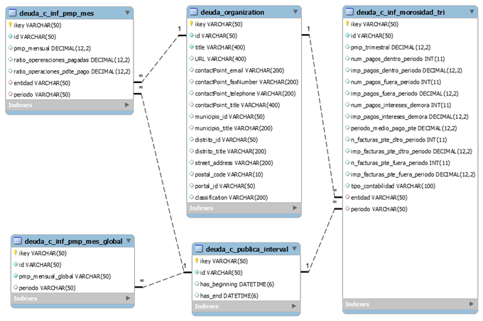

 

# DESARROLLO API REST DE DATOS REUTILIZABLE. MODELO DE TABLAS: 	DEUDA PÚBLICA COMERCIAL

&nbsp;

## **ÍNDICE**   
1. [AUTORES](#id1)
2. [LINKS](#id2)
3. [DIAGRAMA CONCEPTUAL](#id3)
4. [DIAGRAMA ENTIDAD RELACIÓN DE LAS TABLAS](#id40)
5. [TABLAS](#id4)  
    - [DEUDA_C_INF_MOROSIDAD_TRI](#id5)  
    - [DEUDA_C_INF_PMP_MES](#id6)  
    - [DEUDA_C_INF_PMP_MES_GLOBAL](#id7)  
    - [DEUDA_C_PUBLICA_INTERVAL](#id8) 
    - [DEUDA_ORGANIZATION](#id9) 
 

&nbsp;

## AUTORES 
- Carlos Martínez de la Casa García
- Edna Ruckhaus
- Leticia Rubalcaba
- Oscar Corcho
- Juan Carlos Ballesteros 

&nbsp;

## LINKS 

Este documento contiene la información detallada del modelo de datos asociado al vocabulario de los convenios. A continuación, se detallan los enlaces de interés asociados a este vocabulario:

- *[Documentación](http://ciudadesabiertas.es/vocab-economia-deuda-comercial/OnToology/ontology/deudaPublicaComercial.owl/documentation/index-es.html)*
- *[Repositorio](https://github.com/CiudadesAbiertas/vocab-economia-deuda-comercial)*
- *[Requisitos](https://github.com/CiudadesAbiertas/vocab-economia-deuda-comercial/blob/master/requirement/Requisitos%20y%20Glosario%20Deuda%20Publica.xlsx)*

&nbsp;

## DIAGRAMA CONCEPTUAL 
&nbsp;

El diagrama muestra las clases y propiedades del vocabulario que representa la Deuda Pública Financiera como indicador esencial de las cuentas públicas de un ayuntamiento.

&nbsp;

&nbsp;

## DIAGRAMA ENTIDAD RELACIÓN DE LAS TABLAS 

&nbsp;

&nbsp;

## TABLAS     

[comment]: <!!!!!!!!!!!!!!!!!!!!!!!!!!!!!!!!!!!!!!!!!!!!!!!!!!!!!!!!!!!!!!!!!!!!!!!!!!!!!!!!!!!!!!!!> 
&nbsp;
### DEUDA_C_INF_MOROSIDAD_TRI 
&nbsp;
|     Campo                             |     Tipo             |     Ejemplo                                                                                                                                            |     Descripción                                                                                              |     URL                                                                                                             |
|---------------------------------------|----------------------|--------------------------------------------------------------------------------------------------------------------------------------------------------|--------------------------------------------------------------------------------------------------------------|---------------------------------------------------------------------------------------------------------------------|
|     ikey                              |     VARCHAR(50)      |     1                                                                                                                                                  |     Identificador de la Tabla (PK)                                                                           |     ikey                                                                                                            |
|     id                                |     VARCHAR(50)      |     DEUDAC0001                                                                                                                                         |     Identificador de la Deuda Pública                                                                        |     id                                                                                                              |
|     pmp_trimestral                    |     DECIMAL(12,2)    |     50.80                                                                                                                                              |     Período medio de pago  a   proveedores trimestral expresado en días.                                     |     http://vocab.ciudadesabiertas.es/def/economia/deuda-publica-comercial#periodoMedioPagoTrimestral                |
|     num_pagos_dentro_periodo          |     INT(10)          |     6472                                                                                                                                               |     Número de pagos realizados dentro del período legal de pago.                                             | http://vocab.ciudadesabiertas.es/def/economia/deuda-publica-comercial#numPagosDentroPeriodo                         |
|     imp_pagos_dentro_periodo          |     DECIMAL(12,2)    |     51831754.13                                                                                                                                        |     Importe total de pagos realizados dentro del período.                                                    |     http://vocab.ciudadesabiertas.es/def/economia/deuda-publica-comercial#importePagosDentroPeriodo                 |
|     num_pagos_fuera_periodo           |     INT(10)          |     1124                                                                                                                                               |     Número de pagos fuera del período legal de pago.                                                         |     http://vocab.ciudadesabiertas.es/def/economia/deuda-publica-comercial#numPagosFueraPeriodo                      |
|     imp_pagos_fuera_periodo           |     DECIMAL(12,2)    |     5579630.33                                                                                                                                         |     Importe total de pagos realizados fuera del período legal de   pago.                                     |     http://vocab.ciudadesabiertas.es/def/economia/deuda-publica-comercial#importePagosFueraPeriodo                  |
|     num_pagos_intereses_demora        |     INT(10)          |     0                                                                                                                                                  |     Número de pagos de intereses de demora dentro del período.                                               | http://vocab.ciudadesabiertas.es/def/economia/deuda-publica-comercial#numPagosInteresesDemora                       |
|     imp_pagos_intereses_demora        |     DECIMAL(12,2)    |     0.0                                                                                                                                                |     Importe total de intereses de demora pagados en el período.                                              |     http://vocab.ciudadesabiertas.es/def/economia/deuda-publica-comercial#importePagosInteresesDemora               |
|     periodo_medio_pago_pte            |     DECIMAL(12,2)    |     33.87                                                                                                                                              |     Período medio de pago pendiente del período, expresado en   días.                                        |     http://vocab.ciudadesabiertas.es/def/economia/deuda-publica-comercial#periodoMedioPagoPendiente                 |
|     n_facturas_pte_dtro_periodo       |     INT(10)          |     3020                                                                                                                                               |     Número total de facturas pendientes de pago al final del   período de pago dentro del período legal.     |     http://vocab.ciudadesabiertas.es/def/economia/deuda-publica-comercial#numFacturasPendientesDentroPeriodo        |
|     imp_facturas_pte_dtro_periodo     |     DECIMAL(12,2)    |     34441734.41                                                                                                                                        |     Importe total de facturas pendientes de pago al final del   período de pago dentro del período legal.    |     http://vocab.ciudadesabiertas.es/def/economia/deuda-publica-comercial#importeFacturasPendientesDentroPeriodo    |
|     n_facturas_pte_fuera_periodo      |     INT(10)          |     4                                                                                                                                                  |     Número total de facturas pendientes de pago al final del   período de pago fuera del período legal.      |     http://vocab.ciudadesabiertas.es/def/economia/deuda-publica-comercial#numFacturasPendientesFueraPeriodo         |
|     imp_facturas_pte_fuera_periodo    |     DECIMAL(12,2)    |     489769.85                                                                                                                                          |     Importe total de facturas pendientes de pago al final del   período de pago fuera del período legal.     |     http://vocab.ciudadesabiertas.es/def/economia/deuda-publica-comercial#importeFacturasPendientesFueraPeriodo     |
|     tipo_contabilidad                 |     VARCHAR (100)    |     Empresarial                                                                                                                                        |     Tipo de contabilidad: Empresarial o Limitativa                                                           |     http://vocab.ciudadesabiertas.es/def/economia/deuda-publica-comercial#tipoContabilidad                          |
|     entidad                           |     VARCHAR (50)     |     12-28-079-AP-001     URI ejemplo:   http://vocab.ciudadesabiertas.es/recurso/economia/deuda-comercial/organizacion/12-28-079-AP-001                |     Ayuntamiento o entidad dependiente sobre el cual se informa.                                             |     http://vocab.ciudadesabiertas.es/def/economia/deuda-publica-comercial#entidad                                   |
|     periodo                           |     VARCHAR (50)     |     2019-cuarto-trimestre     URI ejemplo: http://vocab.ciudadesabiertas.es/recurso/economia/deuda-comercial/intervalo-tiempo/2019-cuarto-trimestre    |     Período que se está reportando en un informe de morosidad.                                               |     http://vocab.ciudadesabiertas.es/def/economia/deuda-publica-comercial#periodo                                   |

[comment]: <!!!!!!!!!!!!!!!!!!!!!!!!!!!!!!!!!!!!!!!!!!!!!!!!!!!!!!!!!!!!!!!!!!!!!!!!!!!!!!!!!!!!!!!!> 
&nbsp;
### DEUDA_C_INF_PMP_MES 
&nbsp;
|     Campo                          |     Tipo             |     Ejemplo                                                                                                                                |     Descripción                                                                                                          |     URL                                                                                                 |
|------------------------------------|----------------------|--------------------------------------------------------------------------------------------------------------------------------------------|--------------------------------------------------------------------------------------------------------------------------|---------------------------------------------------------------------------------------------------------|
|     ikey                           |     VARCHAR(50)      |     1                                                                                                                                      |     Identificador de la Tabla (PK)                                                                                       |     ikey                                                                                                |
|     id                             |     VARCHAR(50)      |     DEUDACPMPM0001                                                                                                                         |     Identificador de la Deuda Pública                                                                                    |     id                                                                                                  |
|     pmp_mensual                    |     DECIMAL(12,2)    |     18.72                                                                                                                                  |     Período medio de pago a proveedores mensual expresado en días.                                                       |     http://vocab.ciudadesabiertas.es/def/economia/deuda-publica-comercial#periodoMedioPagoMensual       |
|     ratio_operaciones_pagadas      |     DECIMAL(12,2)    |     18.51                                                                                                                                  |     Indicador del número de días promedio que se ha tardado en   realizar los pagos en el período.                       | http://vocab.ciudadesabiertas.es/def/economia/deuda-publica-comercial#ratioOperacionesPagadas           |
|     ratio_operaciones_pdte_pago    |     DECIMAL(12,2)    | 24.2                                                                                                                                       |     indicador del número de días promedio de antigüedad de las   operaciones pendientes de pago al final del período.    |     http://vocab.ciudadesabiertas.es/def/economia/deuda-publica-comercial#ratioOperacionesPendientes    |
|     entidad                        |     VARCHAR (50)     |     12-28-079-AP-001     URI ejemplo:   http://vocab.ciudadesabiertas.es/recurso/economia/deuda-comercial/organizacion/12-28-079-AP-001    |     Ayuntamiento o entidad dependiente sobre el cual se informa.                                                         |     http://vocab.ciudadesabiertas.es/def/economia/deuda-publica-comercial#entidad                       |
|     periodo                        |     VARCHAR (50)     |     2020-06      URI ejemplo: http://vocab.ciudadesabiertas.es/recurso/economia/deuda-comercial/intervalo-tiempo/2020-06                   |     Período que se está reportando en un informe de morosidad.                                                           |     http://vocab.ciudadesabiertas.es/def/economia/deuda-publica-comercial#importePagosFueraPeriodo      |

[comment]: <!!!!!!!!!!!!!!!!!!!!!!!!!!!!!!!!!!!!!!!!!!!!!!!!!!!!!!!!!!!!!!!!!!!!!!!!!!!!!!!!!!!!!!!!> 
&nbsp;
### DEUDA_C_INF_PMP_MES_GLOBAL 
&nbsp;
|     Campo                 |     Tipo             |     Ejemplo                                                                                                                   |     Descripción                                                                                   |     URL                                                                                               |
|---------------------------|----------------------|-------------------------------------------------------------------------------------------------------------------------------|---------------------------------------------------------------------------------------------------|-------------------------------------------------------------------------------------------------------|
|     ikey                  |     VARCHAR(50)      |     1                                                                                                                         |     Identificador de la Tabla (PK)                                                                |     ikey                                                                                              |
|     id                    |     VARCHAR(50)      |     DEUDACPMPMG0001                                                                                                           |     Identificador de la Deuda Pública                                                             |     id                                                                                                |
|     pmp_mensual_global    |     DECIMAL(12,2)    |     18.72                                                                                                                     |     Período medio de pago a proveedores mensual global del   ayuntamiento,  expresado en días.    |     http://vocab.ciudadesabiertas.es/def/economia/deuda-publica-comercial#importePagosFueraPeriodo    |
|     periodo               |     VARCHAR (50)     |     2020-06      URI ejemplo:   http://vocab.ciudadesabiertas.es/recurso/economia/deuda-comercial/intervalo-tiempo/2020-06    |     Período que se está reportando en un informe de morosidad.                                    |     http://vocab.ciudadesabiertas.es/def/economia/deuda-publica-comercial#periodo                     |

[comment]: <!!!!!!!!!!!!!!!!!!!!!!!!!!!!!!!!!!!!!!!!!!!!!!!!!!!!!!!!!!!!!!!!!!!!!!!!!!!!!!!!!!!!!!!!> 
&nbsp;
### DEUDA_C_PUBLICA_INTERVAL 
&nbsp;
|     Campo            |     Tipo           |     Ejemplo                  |     Descripción                           |     URL                                                   |
|----------------------|--------------------|------------------------------|-------------------------------------------|-----------------------------------------------------------|
|     ikey             |     varchar(50)    |     DEUDAPBINT0001           |     Identificador de la Tabla (PK)        |     ikey                                                  |
|     id               |     varchar(50)    |     2019-cuarto-trimestre    |     Identificador del intervalo           |     id                                                    |
|     has_beginning    |     datetime       |     2020-03-31 00:00:00.0    |     Fecha-hora de comienzo del período    |     https://www.w3.org/TR/owl-time/#time:inXSDDateTime    |
|     has_end          |     datetime       |     2020-03-31 00:00:00.0    |     Fecha-hora  de final del   período    |     https://www.w3.org/TR/owl-time/#time:inXSDDateTime    |

[comment]: <!!!!!!!!!!!!!!!!!!!!!!!!!!!!!!!!!!!!!!!!!!!!!!!!!!!!!!!!!!!!!!!!!!!!!!!!!!!!!!!!!!!!!!!!> 
&nbsp;
### DEUDA_ORGANIZATION 
&nbsp;
Esta tabla sigue el estándar de campos que tienen para representar las organizaciones en otros vocabularios. Por lo tanto, no tienen una correspondencia con las propiedades específicas de este vocabulario.   

&nbsp;
Nota: misma tabla que se está utilizando en Deuda Publica Financiera   
&nbsp;

|     Campo                     |     Tipo            |     Ejemplo                                                                  |     Descripción                                                                  |     URL                                                |
|-------------------------------|---------------------|------------------------------------------------------------------------------|----------------------------------------------------------------------------------|--------------------------------------------------------|
|     ikey                      |     varchar(50)     |     1                                                                        |     Identificador de la Tabla (PK)                                               |     ikey                                               |
|     id                        |     varchar(50)     |     12-28-079-AP-001                                                         |     Identificador de la Organización                                             |     https://www.w3.org/TR/vocab-org/#org:identifier    |
|     title                     |     varchar(400)    |     E.M.T. Madrid                                                            |     Contiene el nombre o título de la entidad participante en la   subvención    |                                                        |
|     URL                       |     varchar(400)    |     https://datos.madrid.es/FwFront/portal_egob/new/img/portal_logo_h.png    |     Contiene la URL de la organización                                           |                                                        |
|     contactPoint_email        |     varchar(200)    |     info@aytoxxx.com                                                         |     Contiene la dirección de correo electrónico de la organización               |                                                        |
|     contactPoint_faxNumber    |     varchar(200)    |     1123333333                                                               |     Contiene el número de fax de la organización                                 |                                                        |
|     contactPoint_telephone    |     varchar(200)    |     1123333335                                                               |     Contiene el número de teléfono de la organización                            |                                                        |
|     contactPoint_title        |     varchar(400)    |     Centro Cultural Ayto XXX                                                 |     Contiene el nombre del contacto de la organización                           |                                                        |
|     municipio_id              |     varchar(50)     |     28006                                                                    |     Contiene el identificador del municipio                                      |                                                        |
|     municipio_title           |     varchar(200)    |     Alcobendas                                                               |     Contiene el nombre del municipio                                             |                                                        |
|     distrito_id               |     varchar(50)     |     2800601                                                                  |     Contiene el identificador del distrito                                       |                                                        |
|     distrito_title            |     varchar(200)    |     Distrito 1                                                               |     Contiene el nombre del distrito                                              |                                                        |
|     street_address            |     varchar(200)    |     CALLE BUSTAMANTE V 16                                                    |     Contiene la dirección completa                                               |                                                        |
|     postal_code               |     varchar(10)     |     28045                                                                    |     Contiene el código postal                                                    |                                                        |
|     portal_id                 |     varchar(50)     |     PORTAL000112                                                             |     Contiene el identificador del portal                                         |                                                        |

[comment]: <!!!!!!!!!!!!!!!!!!!!!!!!!!!!!!!!!!!!!!!!!!!!!!!!!!!!!!!!!!!!!!!!!!!!!!!!!!!!!!!!!!!!!!!!> 

&nbsp;

